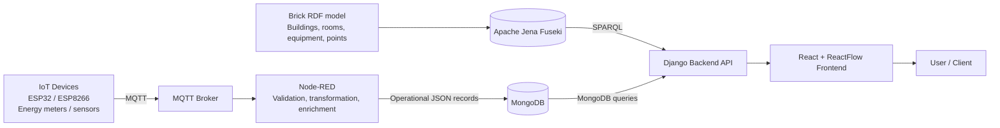

# Brick-Based Semantic Architecture for Smart Building Data Spaces

> A semantic interoperability architecture that connects heterogeneous IoT data, Brick-based building metadata, operational storage, and interactive visualization for smart building and future urban data-space applications.

## Overview

Smart buildings produce data from heterogeneous sensors, energy meters, devices, and control systems. These sources often use different identifiers, message formats, and data models, making it difficult to discover, interpret, integrate, and reuse their information across applications.

This repository documents and implements a **Brick-based semantic architecture** for smart building data spaces. The approach combines:

- **IoT devices** based on ESP32/ESP8266 and energy-monitoring equipment;
- **MQTT** for message delivery;
- **Node-RED** for ingestion, validation, transformation, and enrichment of sensor data;
- **MongoDB** for operational, time-dependent sensor records;
- **Brick Schema** and **Apache Jena Fuseki** for the RDF semantic graph;
- **Django** services for querying and integrating semantic and operational data; and
- **ReactFlow** for interactive visualization of the building semantic graph.

The initial case study models Building 11C at Escuela Superior Politécnica del Litoral (ESPOL), including laboratories, outdoor areas, equipment, sensors, and measurement points.

## Objectives

- Represent building spaces, equipment, sensors, and points using the Brick Schema vocabulary.
- Preserve traceability between physical devices, MQTT messages, semantic entities, and operational data records.
- Enable contextual discovery through SPARQL queries.
- Support the integration of heterogeneous IoT data into a reusable smart-building data space.
- Provide a foundation for future smart-city data spaces, digital twins, analytics, and anomaly-detection applications.

## Architecture



### Data and semantic linking

The architecture separates stable semantic information from dynamic operational measurements:

- The **RDF graph** stores building metadata and relationships, such as locations, equipment, sensors, units, and points.
- **MongoDB** stores time-dependent operational measurements.
- Custom properties such as `espol:db_id` and `espol:point_type` link Brick entities with the corresponding operational data records.

This design allows an application to first retrieve semantic context through SPARQL and then use the resulting operational identifier to request the associated sensor readings.

## Main Components

| Component | Responsibility |
|---|---|
| IoT devices | Collect environmental, energy, and operational measurements. |
| MQTT broker | Delivers sensor messages from devices to the ingestion layer. |
| Node-RED | Validates messages, normalizes variables, enriches metadata, and prepares JSON records. |
| MongoDB | Stores dynamic operational sensor measurements. |
| Brick Schema | Provides a standardized semantic vocabulary for buildings, spaces, equipment, and points. |
| Apache Jena Fuseki | Stores and serves the RDF graph through a SPARQL endpoint. |
| Django | Exposes REST services that bridge the semantic graph and operational repository. |
| ReactFlow | Visualizes RDF entities and relationships as an interactive graph. |

## Repository Structure

```text
.
├── backend/                 # Django project and REST API
│   ├── apps/
│   ├── requirements.txt
│   └── manage.py
├── frontend/                # React + ReactFlow interface
│   ├── src/
│   └── package.json
├── firmware/                # ESP32 / ESP8266 device firmware
├── nodered/                 # Exported Node-RED flows and function nodes
├── semantic/
│   ├── ontology/            # Brick-aligned ontology extensions and namespaces
│   ├── data/                # RDF/Turtle building model instances
│   ├── queries/             # Reusable SPARQL queries
│   └── shacl/               # SHACL validation shapes
├── docs/                    # Architecture diagrams, technical documentation, and screenshots
├── docker/                  # Optional container configuration
├── .env.example             # Environment-variable template; no credentials
├── LICENSE
└── README.md
```

> Adapt this structure to the folders that are ultimately included in the repository. Do not commit passwords, database URIs containing credentials, API tokens, or private deployment configurations.

## Requirements

The implementation uses the following technologies:

- Python 3.10+ and Django
- Node.js 18+ and React
- ReactFlow
- MQTT broker, such as Eclipse Mosquitto
- Node-RED
- MongoDB 6+
- Apache Jena Fuseki 4+
- RDFLib and SPARQLWrapper
- Brick Schema

## Quick Start

### 1. Clone the repository

```bash
git clone https://github.com/<your-github-user>/brick-smart-building-data-space.git
cd brick-smart-building-data-space
```

### 2. Configure environment variables

Create a local environment file from the template:

```bash
cp .env.example .env
```

Example configuration:

```dotenv
# MQTT
MQTT_BROKER_HOST=localhost
MQTT_BROKER_PORT=1883

# MongoDB
MONGODB_URI=mongodb://localhost:27017
MONGODB_DATABASE=smart_building

# Apache Jena Fuseki
FUSEKI_URL=http://localhost:3030
FUSEKI_DATASET=building11c

# Django
DJANGO_SECRET_KEY=replace-this-with-a-secure-local-value
DJANGO_DEBUG=True
DJANGO_ALLOWED_HOSTS=localhost,127.0.0.1
```

### 3. Start infrastructure services

Start or configure the MQTT broker, MongoDB, and Apache Jena Fuseki according to your local or containerized deployment.

For Fuseki, create or load the dataset used by the project and import the Brick-based RDF files from `semantic/data/`.

### 4. Run the Django backend

```bash
cd backend
python -m venv .venv
source .venv/bin/activate        # Windows: .venv\Scripts\activate
pip install -r requirements.txt
python manage.py migrate
python manage.py runserver
```

### 5. Run the React frontend

```bash
cd frontend
npm install
npm run dev
```

### 6. Import Node-RED flows

1. Open the Node-RED editor.
2. Import the flow files from `nodered/`.
3. Configure the MQTT, MongoDB, and metadata variables for your environment.
4. Deploy the flows.

## Sensor Message Contract

Every device message should include enough metadata to preserve traceability between the device, its operational data, and its semantic representation.

Illustrative payload:

```json
{
  "timestamp": "2026-06-19T18:30:00Z",
  "db_id": "11C-LabIoT:airQ1",
  "point_type": "temp",
  "topic": "espol/11c/labiot/airq1",
  "value": 24.5,
  "unit": "degC"
}
```

The exact payload may include additional fields for device identifier, measurement type, phase-specific energy measurements, location metadata, quality flags, or units of measurement.

## Semantic Model

The semantic layer uses Brick classes and properties to represent the smart-building context. Typical entities include:

- `brick:Building`
- `brick:Room`
- `brick:Equipment`
- `brick:Point`
- Sensor-specific classes such as `brick:Temperature_Sensor`

A local `espol:` namespace is used for campus-specific instances and linking properties.

Illustrative RDF/Turtle representation:

```turtle
@prefix brick: <https://brickschema.org/schema/Brick#> .
@prefix unit:  <http://qudt.org/vocab/unit/> .
@prefix espol: <https://www.espol.edu.ec/ESPOL#> .

espol:airQuality1 a brick:Equipment ;
    brick:hasLocation espol:ZonaEntrada ;
    brick:hasPoint espol:airQuality1_temp ;
    espol:db_id "11C-LabIoT:airQ1" .

espol:airQuality1_temp a brick:Temperature_Sensor ;
    brick:hasUnit unit:DEG_C ;
    brick:isPointOf espol:airQuality1 ;
    espol:point_type "temp" .
```

## Example SPARQL Query

The following query retrieves sensors, their associated equipment, optional units, and the identifier required to retrieve operational data:

```sparql
PREFIX brick: <https://brickschema.org/schema/Brick#>
PREFIX espol: <https://www.espol.edu.ec/ESPOL#>

SELECT ?sensor ?equipment ?unit ?db_id ?point_type
WHERE {
  ?sensor brick:isPointOf ?equipment .
  OPTIONAL { ?sensor brick:hasUnit ?unit . }
  OPTIONAL { ?sensor espol:point_type ?point_type . }

  ?equipment a brick:Equipment ;
             espol:db_id ?db_id .

  FILTER(STRSTARTS(STR(?sensor), STR(espol:)))
}
```

## Validation

The implementation should validate the architecture at three complementary levels:

1. **IoT data transmission:** Verify that messages are successfully published, ingested, transformed, and stored in MongoDB.
2. **Semantic consistency:** Verify that spaces, equipment, sensors, points, units, and identifiers are correctly represented in the Brick graph.
3. **Traceability and queryability:** Verify that a sensor can be resolved from the RDF graph to its operational identifier and measurement records.

SHACL constraints can be used to prevent incomplete mappings. For example, a semantic point intended to access operational readings should provide the required metadata, such as an operational identifier and point type.

## API Scope

The Django backend is expected to provide endpoints for operations such as:

- Listing all semantically registered sensors.
- Retrieving equipment, location, units, and operational identifiers for a sensor.
- Requesting recent measurements from MongoDB using a semantic identifier.
- Returning graph data for the ReactFlow interface.
- Validating semantic or ingestion records before registration.

Document the final endpoints in `docs/api.md` or through an OpenAPI/Swagger definition once they are stable.

## Data Management and Security

- Keep device credentials, broker passwords, database credentials, and API tokens outside version control.
- Use `.env` files locally and commit only `.env.example`.
- Avoid publishing raw operational data that may reveal private infrastructure details unless it has been reviewed and anonymized.
- Apply access control to MQTT topics, MongoDB, Fuseki, and the backend in deployed environments.
- Validate incoming messages before persistence to reduce malformed or incomplete semantic links.

## Roadmap

- [ ] Extend the semantic model to additional ESPOL buildings.
- [ ] Incorporate renewable-energy, security, and public-campus infrastructure domains.
- [ ] Automate semantic consistency checks with SHACL.
- [ ] Add containerized deployment with Docker Compose.
- [ ] Integrate a 3D digital-twin platform for visualization and simulation.
- [ ] Add semantic-aware analytics, anomaly detection, and predictive-maintenance workflows.
- [ ] Publish reusable SPARQL query collections and model documentation.

## Contributing

Contributions are welcome from researchers, students, and practitioners interested in smart buildings, semantic interoperability, IoT, digital twins, and urban data spaces.

1. Fork the repository.
2. Create a branch for your contribution.
3. Keep credentials and sensitive deployment details out of commits.
4. Document changes to the ontology, data model, API, or Node-RED flow.
5. Submit a pull request with a clear description and validation evidence.

## Citation

If you use this repository in academic work, please cite the associated manuscript:

```bibtex
@misc{Santillan2026BrickDataSpace,
  author = {Steven Santillan and Kevin Vargas and Pier Colina and Jose Cordova-Garcia},
  title = {Towards Urban Data Interoperability: A Brick-Based Semantic Architecture for Smart Building Data Spaces},
  year = {2026},
  note = {Project repository and manuscript under preparation}
}
```

Update this entry with the final venue, DOI, and publication details when available.

## Authors

- Steven Santillan — Escuela Superior Politécnica del Litoral (ESPOL)
- Kevin Vargas — Escuela Superior Politécnica del Litoral (ESPOL)
- Pier Colina — Escuela Superior Politécnica del Litoral (ESPOL)
- Jose Cordova-Garcia — Escuela Superior Politécnica del Litoral (ESPOL)

## License

This project is licensed under the GNU Affero General Public License v3.0 only
(AGPL-3.0-only).

You may use, study, modify, and redistribute this software under the terms of
the AGPL-3.0-only license. If you modify this software and make it available to
users over a network, you must also provide those users with access to the
corresponding source code of the modified version.

Unless otherwise stated, this license applies to the source code, Node-RED
flows, RDF/TTL semantic models, SPARQL queries, SHACL constraints, deployment
scripts, and example configurations included in this repository.

Third-party libraries, frameworks, and dependencies remain subject to their
respective licenses.

See the [LICENSE](LICENSE) file for the full license text.