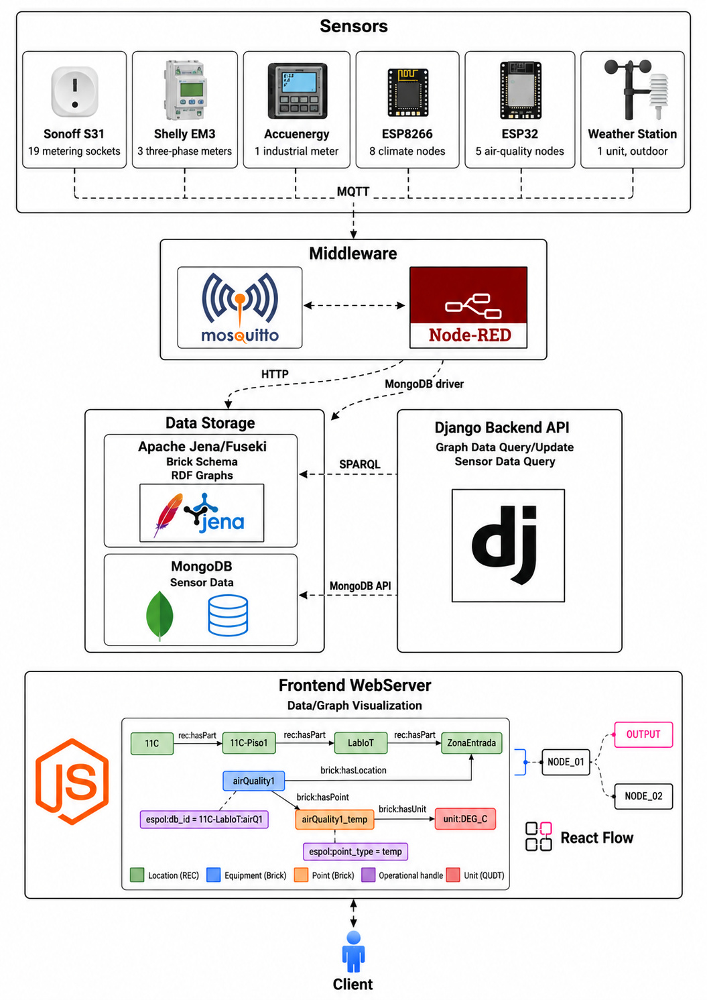
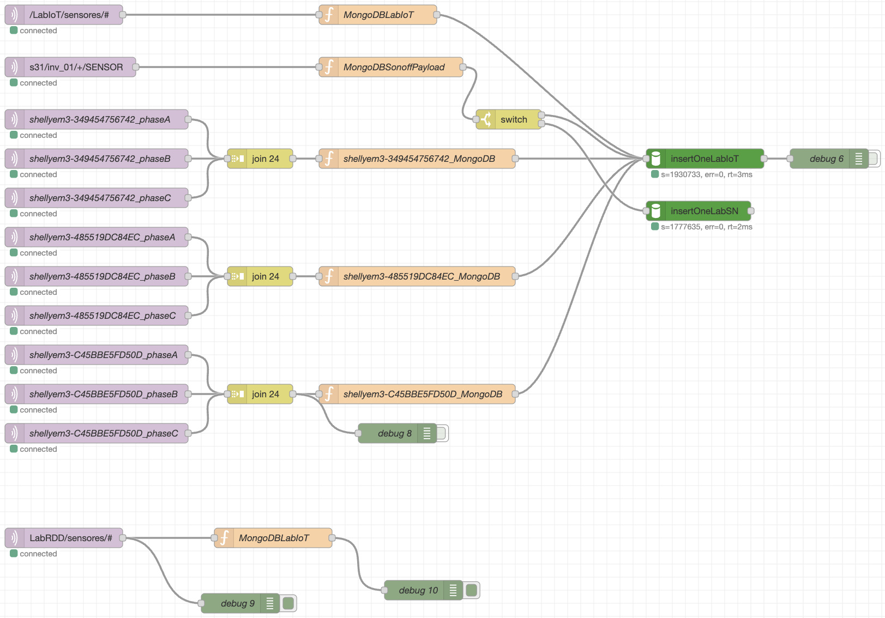

# Brick-Based Semantic Architecture for Smart Building Data Spaces

Semantic model, deployment and evaluation scripts for Building 11C of Escuela
Superior Politécnica del Litoral (ESPOL): **37 equipment entities and 214
measurement points from six device families**, described in Brick Schema and
RealEstateCore, with the readings kept in MongoDB and reached through an
identifier carried on the entity.



The six device families reach Mosquitto over MQTT; Node-RED normalizes each
payload and writes the readings to MongoDB. The Brick and RealEstateCore model
lives in Apache Jena Fuseki, a Django API queries both, and a React frontend
renders the graph.



The ingestion flow as it runs, one branch per device family. It is the same
flow as [`Services/Node-Red/flows.json`](Services/Node-Red/flows.json): the two
write nodes name the collections `11C-LabIoT` and `11C-LabSN`, and the message
counters under each node are from the live deployment.

## How the pieces fit

The design separates the two halves of the problem that change at different
rates. The **semantic layer** describes stable entities — spaces, equipment,
sensors, units — and the **operational layer** stores the time-dependent
measurements. Two local properties join them:

- `espol:db_id` on the equipment names the MongoDB collection and document;
- `espol:point_type` on the point names the field inside it.

An application resolves context with SPARQL, then uses the resulting identifier
to fetch readings. The graph stays bounded because the readings never enter it:
1 257 instance triples, against an order of 450 million a year if they did.
## Repository structure

```text
.
├── Ontology/
│   ├── brickESPOLschema.ttl                     # the released building model
│   ├── brickESPOLschema-before-unit-repair.ttl  # earlier snapshot; carries the
│   │                                            # 46 unresolvable unit IRIs
│   ├── brickESPOLschema.py                      # generator that builds the model
│   ├── Brick.ttl                                # Brick 1.4.4 distribution
│   ├── Brick-REC-alignment.ttl                  # official alignment, 130 triples
│   └── QUDT-units.ttl                           # unit vocabulary, for validation
├── Evaluation/
│   ├── 01..15_*.py                              # 15 measurement scripts
│   ├── results/                                 # raw output, one file per run
│   ├── requirements.txt                         # rdflib, pyshacl
│   └── README.md                                # what each script measures
├── Services/
│   ├── docker-compose.yml                       # MongoDB and Node-RED
│   ├── Node-Red/flows.json                      # the ingestion flow in production
│   └── fuseki/                                  # config.ttl (dataset brickESPOL),
│                                                # shiro.ini and templates
├── WebApp/
│   ├── brickDjangoBackend/                      # REST API over Fuseki and Mongo
│   └── brickNodejsFrontend/                     # React + ReactFlow graph viewer
├── Documents/                                   # zone inventories per laboratory
├── Figures/                                     # architecture and ingestion diagrams
├── requirements.txt                             # backend dependencies
├── Dockerfile                                   # container for the Django backend
└── .env.example                                 # variables to copy into .env
```

[`Figures/`](Figures/) holds the two diagrams above at the resolution they
were captured, so the smaller labels — the message counters of the ingestion
flow among them — stay readable when zoomed.

Two paths are deliberately **not** tracked and are regenerated locally:
`node_modules/` with `npm install`, and `Services/fuseki/databases/` by loading
`Ontology/brickESPOLschema.ttl` into Fuseki.

## Requirements

| | |
|---|---|
| Python | 3.10+ (the container image uses 3.14) |
| Node.js | 18+ |
| MongoDB | 6+ |
| Apache Jena Fuseki | 5.1.0 (the deployment runs `stain/jena-fuseki` on Java 21) |
| Node-RED | any recent release, with a MongoDB node |
| MQTT broker | Eclipse Mosquitto |

The evaluation scripts need only `rdflib==7.1.4` and `pyshacl==0.30.1`.

## Quick start

### 1. Clone and configure

```bash
git clone https://github.com/istevensp/brick-smart-building-data-space.git
cd brick-smart-building-data-space
cp .env.example .env
```

There are **two** `.env` files and neither is tracked. This one, at the root,
is read by the Django backend and the evaluation scripts: `FUSEKI_SPARQL_ENDPOINT`,
`FUSEKI_UPDATE_ENDPOINT`, `FUSEKI_USER`, `FUSEKI_PASSWORD` and `MONGODB_ENDPOINT`.
The second, `Services/.env`, is read by Docker Compose and is set up in step 2.

### 2. Start MongoDB and Node-RED

The compose file reads its credentials from `Services/.env`, which is
git-ignored. Create it first, or `docker compose` stops with a message naming
the variable it is missing:

```bash
cd Services
cp .env.example .env      # then fill in the four values
docker compose up -d
```

`NODERED_ADMIN_PASSWORD_HASH` is a bcrypt hash, not a password. Generate it
with `node-red admin hash-pw`.

### 3. Start Fuseki and load the model

Fuseki reads its users from `Services/fuseki/shiro.ini`, which is git-ignored
for the same reason. Copy the template and set a password:

```bash
cp Services/fuseki/shiro.ini.example Services/fuseki/shiro.ini
```

Then run Fuseki with `Services/fuseki/config.ttl`, which declares a TDB2
dataset named `brickESPOL`, and load the model:

```bash
curl -u "$FUSEKI_USER:$FUSEKI_PASSWORD" -X POST -H 'Content-Type: text/turtle' --data-binary @Ontology/brickESPOLschema.ttl "$FUSEKI_BASE/brickESPOL/data?default"
```

The store this produces occupies about 193 MB on disk for the 1.8 MB Turtle
source, which is why it is not tracked here.

### 4. Run the backend

```bash
python -m venv .brick_env
source .brick_env/bin/activate
pip install -r requirements.txt
cd WebApp/brickDjangoBackend
python manage.py migrate
python manage.py runserver
```

On Windows the activation line is `.brick_env\Scripts\activate`. In a container:

```bash
docker build -t brick-backend .
docker run --env-file .env -p 8000:8000 brick-backend
```

`DJANGO_ALLOWED_HOSTS` has to name the host the client asks for, or Django
answers **400 DisallowedHost**. Reaching the container at `localhost:8000`
works with the default; anything else — another container, an IP, a domain —
has to be listed:

```bash
docker run --env-file .env -p 8000:8000 \
  -e DJANGO_ALLOWED_HOSTS=localhost,127.0.0.1,your.host \
  -e DJANGO_DEBUG=0 \
  -e DJANGO_SECRET_KEY=... \
  brick-backend
```

**Set `DJANGO_DEBUG=0` for anything reachable from outside.** With DEBUG on,
the 400 page above is 58 KB of stack trace and settings; with it off, 143
bytes.

### 5. Run the frontend

```bash
cd WebApp/brickNodejsFrontend/frontend
npm install
npm start
```

`WebApp/brickNodejsFrontend/frontend/package.json` sets `proxy` to the host this was deployed on. **Point
it at your own backend** before running it elsewhere.

### 6. Import the Node-RED flow

Import `Services/Node-Red/flows.json` from the Node-RED editor, set the MQTT
broker and the MongoDB connection for your environment, and deploy. The flow
writes to two collections, `11C-LabIoT` and `11C-LabSN`; a third, `11C-LabRDD`,
is named by the model and is not written by this flow.

## Reproducing the measurements

```bash
pip install -r Evaluation/requirements.txt
python Evaluation/01_graph_audit.py
```

Six of the fifteen scripts — `01`, `06`, `10`, `12`, `14` and `15` — read the
published ontology files and **need no running deployment**. The rest build
in-memory datasets or query the endpoint, and read `FUSEKI_*` from the
environment.

[`Evaluation/README.md`](Evaluation/README.md) says what each script measures
and which of them need a deployment.
[`Evaluation/results/README.md`](Evaluation/results/README.md) lists what each
run reports, the output file it writes, and how long it takes.

Counts do not vary between runs, and ties are broken by name, so two runs of the
same script produce byte-identical files. Every timing is a median across
repeated trials with the interquartile range between them.

## Semantic model

Assets use Brick classes; the spatial layer uses the RealEstateCore classes that
Brick 1.4.4 names as replacements for its own deprecated location hierarchy.
Two local properties carry the join to the operational store:

```turtle
@prefix brick: <https://brickschema.org/schema/Brick#> .
@prefix unit:  <http://qudt.org/vocab/unit/> .
@prefix espol: <https://www.espol.edu.ec/ESPOL#> .

espol:airQuality1 a brick:Equipment ;
    brick:hasLocation espol:ZonaEntrada ;
    brick:hasPoint espol:airQuality1_temp ;
    espol:db_id "11C-LabIoT:airQ1" .

espol:airQuality1_temp a brick:Temperature_Sensor ;
    brick:hasUnit unit:DEG_C ;
    brick:isPointOf espol:airQuality1 ;
    espol:point_type "temp" .
```

A point costs four or five triples and a device three of its own, so the model
grows with what is installed rather than with how long it has been running.

### Example query

Every sensor with its equipment, unit and operational identifier:

```sparql
PREFIX brick: <https://brickschema.org/schema/Brick#>
PREFIX espol: <https://www.espol.edu.ec/ESPOL#>

SELECT ?sensor ?equipment ?unit ?db_id
WHERE {
    ?sensor brick:isPointOf ?equipment .
    OPTIONAL { ?sensor brick:hasUnit ?unit. }
    FILTER(STRSTARTS(STR(?sensor), STR(espol:)))
    ?equipment a brick:Equipment ;
               espol:db_id ?db_id .
}
```

More queries are collected in `WebApp/brickDjangoBackend/FusekiQueries.txt`.

## Validation

`Evaluation/06_brick_validation.py` validates the model with pySHACL against the
254 node shapes of the Brick 1.4.4 distribution, with QUDT resolved into the
data graph and RDFS inference enabled. It reports **41 violations on the
building model**, and they are not defects of this model:

- **37** come from `brick:hasLocation`. The release carries two shapes for that
  property and they do not agree: the one on `brick:Equipment` accepts a
  `rec:Space`, the one on `brick:Entity` accepts only a `brick:Location` — a
  class the same release deprecates in favour of RealEstateCore.
  `10_crossvalidation.py` shows the official Brick–REC alignment changes the
  count by zero, and `15_model_summary.py` prints both shapes.
- **4** are internal to RealEstateCore: the campus is typed both `rec:Campus`
  and `rec:Organization`, and REC constrains the part-of properties once per
  hierarchy. `14_partof_violations.py` shows Brick has no part in these.

The two linking properties are declared as SHACL property shapes on
`brick:Point` that fix their datatype and bound their cardinality at one. They
do **not** require the properties to be present, and no validator runs during
ingestion, so consistency is a property of the registration procedure rather
than one the deployment enforces.

## Security

- `.env` is git-ignored; only `.env.example` is tracked.
- No credential is tracked. `Services/.env` and
  `Services/fuseki/shiro.ini` hold them and are git-ignored; the repository
  ships `.env.example` and `shiro.ini.example` instead.
- `Services/Node-Red/flows.json` uses the documentation addresses of RFC 5737
  (`192.0.2.x`) where the original deployment had its own hosts. Point the MQTT
  and MongoDB nodes at yours before deploying the flow.
- **Earlier values remain in the git history.** Anything that was ever
  committed must be treated as disclosed and rotated, not just removed.
- Apply access control to MQTT, MongoDB, Fuseki and the backend in any
  environment reachable from outside.

## Citation

```bibtex
@inproceedings{Santillan2026BrickDataSpace,
  author    = {Steven Santillan and Kevin Vargas and Pier Colina and Jose Cordova-Garcia},
  title     = {Towards Urban Data Interoperability: A Brick-Based Semantic
               Architecture for Smart Building Data Spaces},
  booktitle = {2026 IEEE International Smart Cities Conference (ISC2)},
  year      = {2026}
}
```

Update the entry with the pages and DOI once they are assigned.

## Authors

Steven Santillan, Kevin Vargas, Pier Colina and Jose Cordova-Garcia — Faculty of
Electrical Engineering and Computer Science, Escuela Superior Politécnica del
Litoral (ESPOL), Guayaquil, Ecuador.

## License

GNU Affero General Public License v3.0 only (AGPL-3.0-only). You may use, study,
modify and redistribute this software under its terms; if you modify it and make
it available to users over a network, you must also give those users access to
the corresponding source of your modified version.

Unless stated otherwise this covers the source code, the Node-RED flow, the
RDF/Turtle models, the SPARQL queries and the deployment configuration in this
repository. Third-party libraries and the Brick, RealEstateCore and QUDT
vocabularies remain under their own licenses.

See [LICENSE](LICENSE) for the full text.

